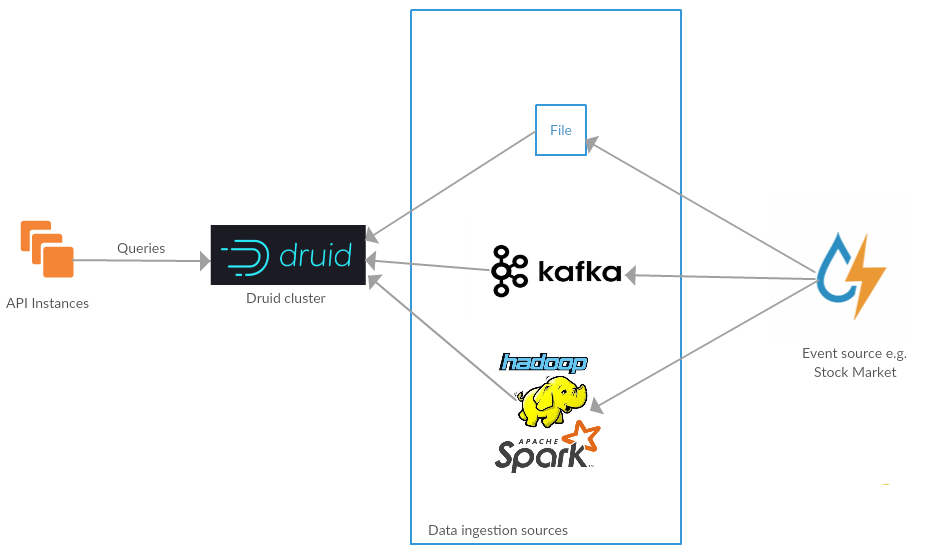

## OLAP solution on [Imply distribution](https://hub.docker.com/r/imply/imply/) of [Apache Druid](http://druid.io/)
**Task:** TimeSlot + 3 dimensions which can be used in random combinations to aggregate the average Price metric.  
This type of data usually comes as an event stream from some kind of exchange/stock market.  
So the technology must be scallable to handle huge amount of data inserts and its parallel aggregation.  
Solution break down:
  1. Use [ingestion specification](./data/ingestion_spec.json) to configure data load from csv file
     * Set *"rollup": true* to pre-aggregate records by 4 dimensions: Portfolio, Owner, Instrument, Date
     * Add 'Count' metric to pre-aggregation to be able to calculate average price later
     * Specify Date as a timestamp with the following granularity:  
        ```
        "queryGranularity": {
            "type": "duration",
            "duration": 10000000,
            "origin": "2018-01-01T00:00:00Z"
        }  
        ```
        So we have specified origin = `2018-01-01 00:00` and its duration in milliseconds = 10_000 seconds according to the task.  
        As a result Druid will aggregate our rows into timeslots of 10_000 seconds duration.  
        For example rows with dates: `01/01/2018 02:27:56`, `01/01/2018 02:33:08` will receive timestamp of `01/01/2018 00:00:00` because they fall into timeslot #0.  
        Rows with dates: `01/01/2018 02:55:16`, `01/01/2018 03:01:14` will receive timestamp of `01/01/2018 02:46:40` because they fall into timeslot #1.  
        And this is perfect for us because these timeslots are indexed and managed on DB side and our calculations become much faster and simplier.  

        After ingestion of the rows below:

        | Portfolio           | Owner     | Instrument | Date                | Price  |
        |---------------------|-----------|------------|---------------------|--------|
        | Fannie Mae          | Walmart   | Bond       | 01/01/2018 02:19:13 | 32.08  |
        | Fannie Mae          | Walmart   | Bond       | 01/01/2018 02:26:45 | 244.01 |
        | Deutsche Bank       | SimCorp   | CDS        | 01/01/2018 02:33:08 | 662.16 |
        | State Bank of India | Google    | Swap       | 01/01/2018 02:55:16 | 80.12  |

        We'll get the following:

        | Portfolio           | Owner     | Instrument | Date                | Price  | Count |
        |---------------------|-----------|------------|---------------------|--------|-------|
        | Fannie Mae          | Walmart   | Bond       | 01/01/2018 00:00:00 | 276,09 | 2     |
        | Deutsche Bank       | SimCorp   | CDS        | 01/01/2018 00:00:00 | 662.16 | 1     |
        | State Bank of India | Google    | Swap       | 01/01/2018 02:46:40 | 80.12  | 1     |

        As you can see first and second rows were pre-aggregated into one row with Price being summed and Count = 2.
  2. Run post aggregation queries to aggregate additionally on selected dimensions and filters on the fly:
      ```
      "filters": { "Owner": "Apple" },
      "intervals": [dateTimeSlotStart, dateTimeSlotStart + 10_000 seconds],
      "aggregations" : [{
        {"type" : "Count", "name" : "Count", "fieldName" : "Count"},
        {"type" : "doubleSum", "name" : "Price", "fieldName" : "Price"}
      }],
      "postAggregations" : [{
        "type"   : "arithmetic",
        "name"   : "AveragePrice",
        "fn"     : "/",
        "fields" : [,
          { "type" : "fieldAccess", "fieldName" : "Price" },
          { "type" : "fieldAccess", "fieldName" : "Count" }
        ]
      }]
      ```

### Diagram


## How to run
- **Application**  
      ```
      docker-compose -f /docker/docker-compose.yml up
      ```  

    Application needs some time to load and index initial data so you may observe log messages like:
    - Beginning indexing data for BigBank
    - Waiting up to 114s for indexing service [http://localhost:8090/] to become available.
    - Request to Druid Coordinator failed with SocketException. Retry in 10 seconds...
    - Redirect response received, retrying with url [http://localhost:8090]
    - Task index_BigBank_2019-03-27T16:38:03.475Z still running...
    - BigBank is 0.0% finished loading...  
  
    So be patient and wait till you see the message: 'BigBank loading complete! You may now query your data'

- **Integration tests**  
      ```
      docker-compose -f docker/run-integration-tests/docker-compose.yml up
      ```  

    Separate dataset docker/run-integration-tests/test_data.csv is used to run integration tests. I have defined http://localhost:54345/healthcheck that returns 200OK when data are loaded and tests can run. Until that tests are wating for healthcheck to pass.

Application URL: [http://localhost:54345/](http://localhost:54345/)  
Swagger URL (API Explorer): [http://localhost:54345/api/swagger/](http://localhost:54345/api/swagger/)  
Druid Console URL: [http://localhost:8881](http://localhost:8881)  
Imply Console URL: [http://localhost:9095](http://localhost:9095) where you can query loaded data set using SQL

## Usage example
  ```
  > curl -X GET "http://localhost:54345/api/prices/average?owner=Apple&instrument=Deposit&date=2018-01-01"
  ```
  Result:
  ```
  {
    "date": "01/01/2018 00:00:00",
    "price": 246.82
  }
  ```

## Troubleshooting
 If you see errors like 'Error 500 response' or 'Traceback' from /docker/druid_ingest_data.py script during container startup then please restart the container with docker-compose again. Druid requires powerful hardware to run and may fail to start sometimes. Restart usually helps.
